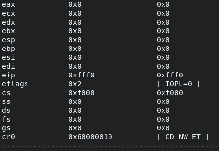
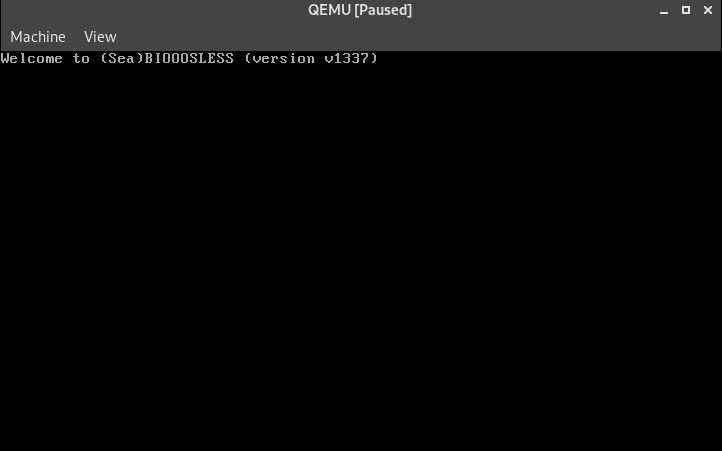
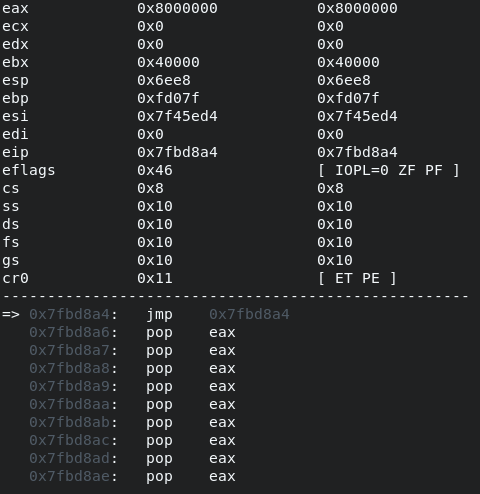
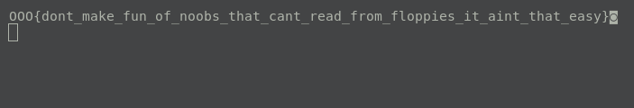

# __DEF CON CTF Qualifier 2020__
## _biooosless_

**Category:** | **Solves:**  | **Points:**
--- | --- | ---
rev, shellcode | 29 | 145

**Description:** 
>Q: can you read from a floppy?
>
>A: LOL, yes, just mount it and read its content …
>
>Q: OK. But what if there is no OS?
>
>A: ahah, ROFLT, yes, just invoke BIOS routines and read it …
>
>Q: OK. But if there is no BIOS?
>
>A: F. M. L.
>
>biooosless.challenges.ooo 6543
>
>Files:
>[local-setup.tgz](task/local-setup.tgz)
>
>6a0364e9e4462365112ede26398098d5c6cc44837a37ece5ff8a04fb5b39e6b4

## Solution

In the archive we can find the following files:
* `bios-template.bin` - modified SEABIOS binary file
* `Dockerfile-local-setup` - in case if we want to test shellcode on server-like environment
* `floppy-dummy-flag.img` - sample of floppy disk image, where on offset `0x4400` we can discover flag pattern
* `local-run.py` - script to insert our shellcode in part of BIOS binary and run QEMU with it
* `README-local-setup.md` - information about how to run the task

Unpack it near your future shellcode.

First of all, let's write a small shellcode with infinity loop:
```
jmp $
```
And compile it with NASM:
```
nasm -f bin shellcode.asm -o shellcode.bin
```
So, that helps us to understand if the program flow comes to our shellcode at all and at what address it is. Knowing the address we can set the breakpoint on it and debug the shellcode.

The next step is setting up the debugger. QEMU has own gdbserver and enables it by adding the `-s` in command line (in this case it will be on `localhost:1234`). Also we can add `-S` to stop the machine at the beginning. I used `gdb` as a debugger, but also there was opportunity use something else which can be connected to QEMU gdbserver.
GDB assistants (like `gef`) aren't working, so we need write a small helper to watch the flow by ourselves. You can take my one from [here](gdb.py) and run it by typing `sourse gdb.py` in gdb console.



The computers of Intel architecture start their execution in real mode and from `0xffff0` address, where usually the `jmp` instruction is located (we can check it in `bios-template.bin` file by openning it in IDA), everything is OK. Typing `c` we will continue the execution and then get into our infinity loop.




So, the base of shellcode is `0x7fbd8a4` and we can note from register `cr0` that it is protected mode. But even if we back to real mode, we don't have desired interrupts (int13 could read from floppy), so it would be useless. There is a need to write a communication with a floppy in protected mode.

Next, we want to output the information on screen, we should print the flag in future. I started to enumerate VGA buffer addresess (like `0xB8000`, `0xA0000`) and dump it with `gdb` by `x/x10 <address>` command. The first one - `0xB8000` was right, we can see the greeting text there. Moreover, the format is: one byte of character color and then byte of character. Indeed, writing bytes from this offset changes the picture.

The environment for debugging a shellcode is ready, the next step is write code to read sectors from floppy. It uses ISA DMA and how to implement data transfer from it can't be discribed better than it discribed on the Internet. Try to read this [link](https://wiki.osdev.org/Floppy_Disk_Controller) or find implementations somewhere else. But just for the shellcode we can skip some moments like implementing IRQ6 handler, it would work anyway since device processing is fast enough and there is no need for synchronization.

At this point we can understand that it might be a lot of code to write and it would be better to write it in C language. The source is available [here](shellcode.c), I compile it with the following command to avoid any unnecessary things (`link.ld` is presented [here](link.ld)):
```
gcc shellcode.c -ffreestanding -fno-builtin -fno-stack-protector -nostdlib -masm=intel -m32 -T link.ld -fno-pie -o shellcode.bin
```

In `floppy-dummy-flag.img` we can see that flag pattern takes place on offset `0x4400`. Let's calculate the LBA to this sector to insert the number in code:
```
offset = 0x4400
sector_size = 0x200
lba = offset / sector_size = 34
```

And then running the `python local-run.py shellcode.bin` gives us a pattern of flag, the same as server gives the flag!


