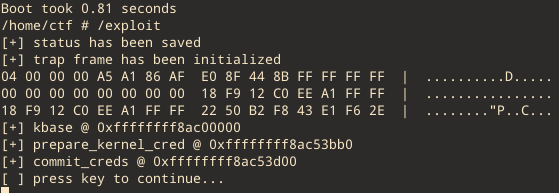
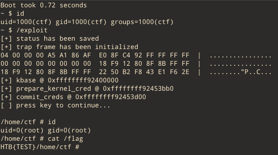

# __HTB Uni CTF 2021 Finals__
## _baby beta driver_

**Category:** | **Solves:**  | **Points:**
--- | --- | ---
pwn | < 10 | ?

**Description:** 
>This was a leaked driver from some up and coming startup! The memo shows that the boss is irritated by redundancy in the program... just how safe can this driver be?

## Solution

Initially unpack “initramfs.cpio” from which we can get the binary file of the driver. After analyzing it in IDA Pro, we can conclude that it has two IOCTL commands and two bugs.
The first is “kmalloc” doesn’t have the flag GPF_ZERO, so the data in the chunk is not nullified. By sending a IOCTL with the 0x1337C0DE command and a zero “transfer_data” field (to avoid copying any data into the chunk), and then sending a IOCTL with the 0xC0DE1337 command with the “transfer_data” field equal to the mapped area, we can read data from kernel heap (a maximum of 0x30 bytes). Here we can leak the kernel base address.

The second bug is stack overflow in IOCTL with command 0xC0DE1337. By sending a IOCTL with the 0x1337C0DE command and “transfer_data” field equal to the mapped area with ROPs, and then sending a IOCTL with 0xC0DE1337 command with the same ‘request’ structure, we can overflow the stack (“tempstorage” buffer) and execute our ROP.

